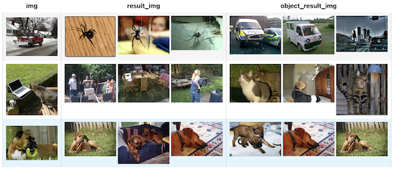

summary: Deep Dive into Reverse Image Search
id: deep-dive-into-reverse-image-search-with-towhee
categories: Image
tags: reverse-image-search
status: Published
authors: Shiyu
Feedback Link: https://github.com/towhee-io/towhee

---

# Reverse Image Search II: Deep Dive with Towhee

In the previous "Build a Reverse Image Search Engine in Minutes" codelab, we built and prototyped a proof-of-concept reverse image search engine. Now, let's optimize our algorithm, feed it with large-scale image datasets, and deploy it as a micro-service with Towhee.

## Preparation

duration: 1

### Install Dependencies

First we need to install dependencies such as pymilvus, towhee, transformers, opencv-python and fastapi.

```bash
$ python -m pip -q install pymilvus towhee transformers fastapi opencv-python
```

### Prepare the data

There is a subset of the ImageNet dataset (100 classes, 10 images for each class) is used in this demo, and the dataset is available via [Github](https://github.com/towhee-io/examples/releases/download/data/reverse_image_search.zip). The dataset is same as our previous codelab: "Build a Reverse Image Search Engine in Minutes", and to make things easy, we'll repeat the important code blocks below; if you have already downloaded data, please move on to next section.

The dataset is organized as follows:

- **train**: directory of candidate images;
- **test**: directory of the query images;
- **reverse_image_search.csv**: a csv file containing an ***id\***, ***path\***, and ***label\*** for each image;

```bash
$ curl -L https://github.com/towhee-io/examples/releases/download/data/reverse_image_search.zip -O
$ unzip -q -o reverse_image_search.zip
```

To use the dataset for image search, let's first define some helper functions:

- **read_images(results)**: read images by image IDs;
- **ground_truth(path)**: ground-truth for each query image, which is used for calculating mHR(mean hit ratio) and mAP(mean average precision);

```python
import cv2
import pandas as pd
from towhee._types.image import Image

df = pd.read_csv('reverse_image_search.csv')
df.head()

id_img = df.set_index('id')['path'].to_dict()
label_ids = {}
for label in set(df['label']):
    label_ids[label] = list(df[df['label']==label].id)

def read_images(results):
    imgs = []
    for re in results:
        path = id_img[re.id]
        imgs.append(Image(cv2.imread(path), 'BGR'))
    return imgs

def ground_truth(path):
    label = path.split('/')[-2]
    return label_ids[label]
```

### Create a Milvus Collection

Before getting started, please make sure you have [installed milvus](https://milvus.io/docs/v2.0.x/install_standalone-docker.md). Let's first create a `reverse_image_search` collection that uses the [L2 distance metric](https://milvus.io/docs/v2.0.x/metric.md#Euclidean-distance-L2) and an [IVF_FLAT index](https://milvus.io/docs/v2.0.x/index.md#IVF_FLAT).

```python
from pymilvus import connections, FieldSchema, CollectionSchema, DataType, Collection, utility

connections.connect(host='127.0.0.1', port='19530')

def create_milvus_collection(collection_name, dim):  
    if utility.has_collection(collection_name):
        utility.drop_collection(collection_name)
    
    fields = [
    FieldSchema(name='id', dtype=DataType.INT64, descrition='ids', is_primary=True, auto_id=False),
    FieldSchema(name='embedding', dtype=DataType.FLOAT_VECTOR, descrition='embedding vectors', dim=dim)
    ]
    schema = CollectionSchema(fields=fields, description='reverse image search')
    collection = Collection(name=collection_name, schema=schema)

    index_params = {
        'metric_type':'L2',
        'index_type':"IVF_FLAT",
        'params':{"nlist":2048}
    }
    collection.create_index(field_name="embedding", index_params=index_params)
    return collection
```

## Improve the Model

duration: 3

In "**Build a Reverse Image Search Engine in Minutes**" codelab, we evaluated the search engine with **mHR** and **mAP** and have already tried to improve the metrics by normalizing the embedding features and using a more complex model. The experiment shows a significant boost in the metrics.

Let's runs some more experiments, with the end goal of improving the search results. First, we begin with a benchmark that compares `ResNet` and `VGG` models to the increasingly popular Vision Transformer (`ViT`), to see whether we can achieve better accuracy or get a reasonable trade-off between the accuracy and performance. We will then try to fix some bad cases by a preceding object detection model.

### Model Benchmark: VGG vs ResNet vs EfficientNet

Three models will be included in the benchmark: `VGG16`, `resnet50`, and `efficientnet-b2`. We won't include too many models in this tutorial, but we encourage you to play around with different models We can't include too much models in this notebook, for it might be too much time-comsuming for the readers. But you can add your own interested model to the benchmark and try the notebook on your own machine, for example, `VGG19` (4096-d), `resnet101` (2048-d), or `efficient-b7`(2560-d). The following metrics will be included in the benchmark:

- [mHR (recall@K)](https://amitness.com/2020/08/information-retrieval-evaluation/#2-recallk): This metric describes how many actual relevant results were returned out of all ground-truth relevant results by the search engine. For example, if we have put 100 pictures of cats into the search engine and then query the image search engine with another picture of cats. The total relevant result is 100, and the actual relevant results are the number of cat images in the top 100 results returned by the search engine. If there are 80 images about cats in the search result, the hit ratio is 80/100;
- [mAP](https://amitness.com/2020/08/information-retrieval-evaluation/#3-mean-average-precisionmap): Average precision describes whether all of the relevant results are ranked higher than irrelevant results.

We'll use a helper class to compute runtime:

```python
import time

class Timer:
    def __init__(self, name):
        self._name = name

    def __enter__(self):
        self._start = time.time()
        return self

    def __exit__(self, *args):
        self._interval = time.time() - self._start
        print('%s: %.2fs'%(self._name, self._interval))
```

Then to run some models to evaluate:

```python
import towhee

model_dim = {
    'vgg16': 4096,
    'resnet50': 2048,
    'tf_efficientnet_b2': 1408
}

for model in model_dim:
    collection = create_milvus_collection(model, model_dim[model])
        
    with Timer(f'{model} load'):
        ( 
            towhee.read_csv('reverse_image_search.csv')
                .runas_op['id', 'id'](func=lambda x: int(x))
                .image_decode['path', 'img']()
                .image_embedding.timm['img', 'vec'](model_name=model)
                .tensor_normalize['vec', 'vec']()
                .to_milvus['id', 'vec'](collection=collection, batch=100)
        )
    with Timer(f'{model} query'):
        ( towhee.glob['path']('./test/*/*.JPEG')
                .image_decode['path', 'img']()
                .image_embedding.timm['img', 'vec'](model_name=model)
                .tensor_normalize['vec', 'vec']()
                .milvus_search['vec', 'result'](collection=collection, limit=10)
                .runas_op['path', 'ground_truth'](func=ground_truth)
                .runas_op['result', 'result'](func=lambda res: [x.id for x in res])
                .with_metrics(['mean_hit_ratio', 'mean_average_precision'])
                .evaluate['ground_truth', 'result'](model)
                .report()
        )
```


### **Vision Transformer**

Now, let's try using a transformer-based model. We'll first initialize the embedding model for use in a `vit_embedding` function which can be directly called to generate the embedding vector. This function can then be used via `runas_op` in `DataCollection`.

```
import torch
from transformers import ViTFeatureExtractor, ViTModel
from towhee.types.image_utils import to_image_color

feature_extractor = ViTFeatureExtractor.from_pretrained('google/vit-large-patch32-384')
model = ViTModel.from_pretrained('google/vit-large-patch32-384')
device = torch.device('cuda' if torch.cuda.is_available() else 'cpu')
model.to(device)


def vit_embedding(img):
    img = to_image_color(img, 'RGB')
    inputs = feature_extractor(img, return_tensors="pt")
    outputs = model(inputs['pixel_values'].to(device))
    return outputs.pooler_output.detach().cpu().numpy().flatten()

collection = create_milvus_collection('huggingface_vit', 1024)

with Timer('ViT load'):
    ( 
        towhee.read_csv('reverse_image_search.csv')
            .runas_op['id', 'id'](func=lambda x: int(x))
            .image_decode['path', 'img']()
            .runas_op['img', 'vec'](func=vit_embedding)
            .tensor_normalize['vec', 'vec']()
            .to_milvus['id', 'vec'](collection=collection, batch=100)
    )

with Timer('ViT query'):
    ( 
        towhee.glob['path']('./test/*/*.JPEG')
            .image_decode['path', 'img']()
            .runas_op['img', 'vec'](func=vit_embedding)
            .tensor_normalize['vec', 'vec']()
            .milvus_search['vec', 'result'](collection=collection, limit=10)
            .runas_op['path', 'ground_truth'](func=ground_truth)
            .runas_op['result', 'result'](func=lambda res: [x.id for x in res])
            .with_metrics(['mean_hit_ratio', 'mean_average_precision'])
            .evaluate['ground_truth', 'result']('huggingface_vit')p
            .report()
            
    )
```


We ran the experiment above on our own and found that `ViT-large` performed the best in this dataset. `EfficientNet-B2` also performs well (with less than half the runtime of `ViT-large`). We encourage you to try using your own datasets, model architectures, and training techniques for comparison.


**Note:** There are also predefined operators of `ViT` models on towhee hub. You can try the other `ViT` models with the [image-embedding/timm](https://towhee.io/image-embedding/timm).

## Dimensionality Reduction

duration: 2

In a production system it is often practical to mimimize the embedding dimension in order to minimize memory consumption. [Random projection](https://en.wikipedia.org/wiki/Random_projection) is a dimensionality reduction method for a set vectors in Euclidean space. Since this method is fast and requires no training, we'll try this technique on embeddings generated by the `EfficientNet-B2` model:

```python
import numpy as np

projection_matrix = np.random.normal(scale=1.0, size=(1408, 512))

def dim_reduce(vec):
    return np.dot(vec, projection_matrix)

collection = create_milvus_collection('tf_efficientnet_b2_512', 512)

# load embeddings into milvus
( 
    towhee.read_csv('reverse_image_search.csv')
        .runas_op['id', 'id'](func=lambda x: int(x))
        .image_decode['path', 'img']()
        .image_embedding.timm['img', 'vec'](model_name='tf_efficientnet_b2')
        .runas_op['vec','vec'](func=dim_reduce)
        .tensor_normalize['vec', 'vec']()
        .to_milvus['id', 'vec'](collection=collection, batch=100)
)

# query and evaluation
( towhee.glob['path']('./test/*/*.JPEG')
        .image_decode['path', 'img']()
        .image_embedding.timm['img', 'vec'](model_name='tf_efficientnet_b2')
        .runas_op['vec','vec'](func=dim_reduce)
        .tensor_normalize['vec', 'vec']()
        .milvus_search['vec', 'result'](collection=collection, limit=10)
        .runas_op['path', 'ground_truth'](func=ground_truth)
        .runas_op['result', 'result'](func=lambda res: [x.id for x in res])
        .with_metrics(['mean_hit_ratio', 'mean_average_precision'])
        .evaluate['ground_truth', 'result']('tf_efficientnet_b2_512')
        .report()
)
```


The dimension of embedding vectors is reduced from 1408 to 512, thereby reducing memory usage by around 60%. Despite this, it maintains a reasonable performance (91.6% mAP for reduced vectors vs 92.5% for full vectors).

## **Object Detection with YOLO**

duration: 2

Finally, we can try cropping candidate bounding boxes reverse image search, i.e. use YOLOv5 to get the object of the image before image feature vector extraction, and then use that object to represent the image data for insertion and search.

`get_object` function is used to get the image of the largest object detected by YoLov5, or the image itself if there is no object, then insert the resulting image into Milvus, and finally do the search. Object detection is very common in product search.

```python
yolo_collection = create_milvus_collection('yolo', 2048)
resnet_collection = create_milvus_collection('resnet', 2048)

def get_object(img, boxes):
    if len(boxes) == 0:
        return img
    max_area = 0
    for box in boxes:
        x1, y1, x2, y2 = box
        area = (x2-x1)*(y2-y1)
        if area > max_area:
            max_area = area
            max_img = img[y1:y2,x1:x2,:]
    return max_img

with Timer('resnet load'):
    (towhee.read_csv('reverse_image_search.csv')
        .runas_op['id', 'id'](func=lambda x: int(x))
        .image_decode['path', 'img']()
        .image_embedding.timm['img', 'vec'](model_name='resnet50')
        .tensor_normalize['vec', 'vec']()
        .to_milvus['id', 'vec'](collection=resnet_collection, batch=100)
    )

with Timer('yolo+resnet load'):
    (towhee.read_csv('reverse_image_search.csv')
        .runas_op['id', 'id'](func=lambda x: int(x))
        .image_decode['path', 'img']()
        .object_detection.yolov5['img', ('boxes', 'class', 'score')]()
        .runas_op[('img', 'boxes'), 'object'](func=get_object)
        .image_embedding.timm['object', 'object_vec'](model_name='resnet50')
        .tensor_normalize['object_vec', 'object_vec']()
        .to_milvus['id', 'object_vec'](collection=yolo_collection, batch=100)
    )

```

resnet load: 16.98s
yolo+resnet load: 33.97s

Using a preceding object detection with yolo can fix the bad cases, but it also makes the search engine much slower.



## Making Our Image Search Engine Production Ready

duration: 2

To put the image search engine into production, we need to feed it with a large-scale dataset and deploy a microservice to accept incoming queries.

### Optimize for large-scale dataset

When the dataset becomes very large, as huge as tens of millions of images, it faces two significant problems:

1. embedding feature extractor and Milvus data loading needs to be fast so that we can finish the search index in time;
2. There are corrupted images or images with wrong formats in the dataset. It is impossible to clean up all such bad cases when the dataset is huge. So the data pipeline needs to be very robust to such exceptions.

Towhee supports parallel execution to improve performance for large-scale datasets, and also has `exception_safe` execution mode to ensure system stability.

### Improve Performance with Parallel Execution

We are able to enable parallel execution by simply calling `set_parallel` within the pipeline. It tells towhee to process the data in parallel. Here is an example that enables parallel execution on a pipeline using ViT model. It can be seen that the execution speed below is nearly three times faster than before. And note that please clean up the GPU cache before runing with parallel.

```python
collection = create_milvus_collection('test_resnet101', 2048)
with Timer('resnet101 load'):
    ( 
        towhee.read_csv('reverse_image_search.csv')
            .runas_op['id', 'id'](func=lambda x: int(x))
            .image_decode['path', 'img']()
            .image_embedding.timm['img', 'vec'](model_name='resnet101')
            .tensor_normalize['vec', 'vec']()
            .to_milvus['id', 'vec'](collection=collection, batch=100)
    )
    
collection_parallel = create_milvus_collection('test_resnet101_parallel', 2048)
with Timer('resnet101+parallel load'):
    ( 
        towhee.read_csv('reverse_image_search.csv')
            .runas_op['id', 'id'](func=lambda x: int(x))
            .set_parallel(3)
            .image_decode['path', 'img']()
            .image_embedding.timm['img', 'vec'](model_name='resnet101')
            .tensor_normalize['vec', 'vec']()
            .to_milvus['id', 'vec'](collection=collection_parallel, batch=100)
    )
```

resnet101 load: 21.04s
resnet101+parallel load: 14.42s

### Exception Safe Execution

When we have large-scale image data, there may be bad data that will cause errors. Typically, the users don't want such errors to break the production system. Therefore, the data pipeline should continue to process the rest of the images and report the errors.

Towhee supports an exception-safe execution mode that allows the pipeline to continue on exceptions and represent the exceptions with `Empty` values. The user can choose how to deal with the `Empty` values at the end of the pipeline. During the query below, there are four images in total, one of them is broken, it just prints an error message instead of terminating because it has `exception_safe` and `drop_empty`, as you can see, `drop_empty` deletes `empty` data.

```python
(
    towhee.glob['path']('./exception/*.JPEG')
        .exception_safe()
        .image_decode['path', 'img']()
        .image_embedding.timm['img', 'vec'](model_name='resnet50')
        .tensor_normalize['vec', 'vec']()
        .milvus_search['vec', 'result'](collection=resnet_collection, limit=5)
        .runas_op['result', 'result_img'](func=read_images)
        .drop_empty()
        .select['img', 'result_img']()
        .show()
)
```


## Deploy as a Microservice

duration: 2

The data pipeline used in our experiments can be converted to a function with `towhee.api` and `as_function()`, and we can also convert the data pipeline into a RESTful API with `serve()`, it generates FastAPI services from towhee pipelines.

### Insert Image Data

```python
import time
import towhee
from fastapi import FastAPI
from pymilvus import connections, Collection

app = FastAPI()
connections.connect(host='127.0.0.1', port='19530')
milvus_collection = Collection('resnet50')

@towhee.register(name='get_path_id')
def get_path_id(path):
    timestamp = int(time.time()*10000)
    id_img[timestamp] = path
    return timestamp

@towhee.register(name='milvus_insert')
class MilvusInsert:
    def __init__(self, collection):
        self.collection = collection

    def __call__(self, *args, **kwargs):
        data = []
        for iterable in args:
            data.append([iterable])
        mr = self.collection.insert(data)
        self.collection.load()
        return str(mr)

with towhee.api['file']() as api:
    app_insert = (
        api.image_load['file', 'img']()
        .save_image['img', 'path'](dir='tmp/images')
        .get_path_id['path', 'id']()
        .image_embedding.timm['img', 'vec'](model_name='resnet50')
        .tensor_normalize['vec', 'vec']()
        .milvus_insert[('id', 'vec'), 'res'](collection=milvus_collection)
        .select['id', 'path']()
        .serve('/insert', app)
    )
```

### Search Similar Image

```python
with towhee.api['file']() as api:
    app_search = (
        api.image_load['file', 'img']()
        .image_embedding.timm['img', 'vec'](model_name='resnet50')
        .tensor_normalize['vec', 'vec']()
        .milvus_search['vec', 'result'](collection=milvus_collection)
        .runas_op['result', 'res_file'](func=lambda res: str([id_img[x.id] for x in res]))
        .select['res_file']()
        .serve('/search', app)
    )
```

### Count Numbers

```python
with towhee.api() as api:
    app_count = (
        api.map(lambda _: milvus_collection.num_entities)
        .serve('/count', app)
        )
```

### Start Server

```python
import uvicorn
import nest_asyncio

nest_asyncio.apply()
uvicorn.run(app=app, host='0.0.0.0', port=8000)
```

Finally to start FastAPI, there are three services `/insert`, `/search` and `/count`, you can run the following commands to test:

```bash
# upload an image and search
$ curl -X POST "http://0.0.0.0:8000/search"  --data-binary @test/lion/n02129165_13728.JPEG -H 'Content-Type: image/jpeg'
# upload an image and insert
$ curl -X POST "http://0.0.0.0:8000/insert"  --data-binary @test/banana/n07753592_323.JPEG -H 'Content-Type: image/jpeg'
# count the collection
$ curl -X POST "http://0.0.0.0:8000/count"
```

