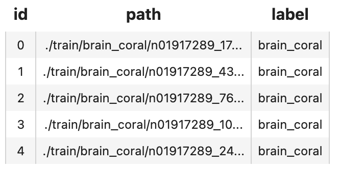
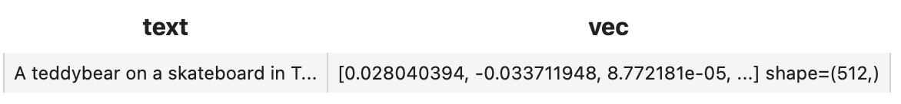

summary: Build a Text-Image Search Engine in Minutes
id: build-a-text-image-search-engine-in-minutes
categories: Image
tags: test-image-search
status: Published
authors: Zhuoran
Feedback Link: https://github.com/towhee-io/towhee

---

# Build a Text-Image Search Engine in Minutes

## Introduction

duration: 1

This codelab will show how to build an text-image search engine with Towhee and Milvus, which means search for matched or related images with the input text.

The basic idea behind our text-image search is the extract embeddings from images and texts using a deep neural network and compare the embeddings with those stored in Milvus. Then to use [Towhee](https://towhee.io/), a machine learning framework that allows for creating data processing pipelines, and it also provides predefined operators which implement insert and query operation in Milvus.


## Preparation

duration: 2

### Install Dependencies

First we need to install dependencies such as pymilvus, towhee and gradio.

```bash
$ python -m pip install -q pymilvus towhee gradio
```

### Prepare the data

The dataset used in this demo is a subset of the ImageNet dataset (100 classes, 10 images for each class), and the dataset is available via [Github](https://github.com/towhee-io/examples/releases/download/data/reverse_image_search.zip).

The dataset is organized as follows:

- **train**: directory of candidate images;
- **test**: directory of test images;
- **reverse_image_search.csv**: a csv file containing an ***id\***, ***path\***, and ***label\*** for each image;

First to download the dataset and unzip it:

```bash
$ curl -L https://github.com/towhee-io/examples/releases/download/data/reverse_image_search.zip -O
$ unzip -q -o reverse_image_search.zip
```

Let's take a quick look:

```python
import pandas as pd

df = pd.read_csv('reverse_image_search.csv')
df.head()
```



To use the dataset for text-image search, let's first define some helper function:

- **read_images(results)**: read images by image IDs;

```python
import cv2
from towhee._types.image import Image

id_img = df.set_index('id')['path'].to_dict()
def read_images(results):
    imgs = []
    for re in results:
        path = id_img[re.id]
        imgs.append(Image(cv2.imread(path), 'BGR'))
    return imgs
```

### Create a Milvus Collection

Before getting started, please make sure you have [installed milvus](https://milvus.io/docs/v2.0.x/install_standalone-docker.md). Let's first create a `text_image_search` collection that uses the [L2 distance metric](https://milvus.io/docs/v2.0.x/metric.md#Euclidean-distance-L2) and an [IVF_FLAT index](https://milvus.io/docs/v2.0.x/index.md#IVF_FLAT).

```python
from pymilvus import connections, FieldSchema, CollectionSchema, DataType, Collection, utility

connections.connect(host='127.0.0.1', port='19530')

def create_milvus_collection(collection_name, dim):
    if utility.has_collection(collection_name):
        utility.drop_collection(collection_name)
    
    fields = [
    FieldSchema(name='id', dtype=DataType.INT64, descrition='ids', is_primary=True, auto_id=False),
    FieldSchema(name='embedding', dtype=DataType.FLOAT_VECTOR, descrition='embedding vectors', dim=dim)
    ]
    schema = CollectionSchema(fields=fields, description='text image search')
    collection = Collection(name=collection_name, schema=schema)

    # create IVF_FLAT index for collection.
    index_params = {
        'metric_type':'L2',
        'index_type':"IVF_FLAT",
        'params':{"nlist":512}
    }
    collection.create_index(field_name="embedding", index_params=index_params)
    return collection

collection = create_milvus_collection('text_image_search', 512)
```

## Generate image and text embeddings with CLIP

duration: 2

[CLIP](https://openai.com/blog/clip/) Operator can be used generate embeddings for text and image by jointly training an image encoder and text encoder to maximize the cosine similarity.

```python
import towhee

towhee.glob['path']('./teddy.png') \
      .image_decode['path', 'img']() \
      .image_text_embedding.clip['img', 'vec'](model_name='clip_vit_b32', modality='image') \
      .tensor_normalize['vec','vec']() \
      .select['img', 'vec']() \
      .show()
```


And we can set the parameter `modality='text'` to get the text embedding:

```python
towhee.dc['text'](["A teddybear on a skateboard in Times Square."]) \
      .image_text_embedding.clip['text','vec'](model_name='clip_vit_b32', modality='text') \
      .tensor_normalize['vec','vec']() \
      .select['text', 'vec']() \
      .show()
```



Here is detailed explanation of the code:

- `.image_decode['path', 'img']()`: for each row from the data, read and decode the image at `path` and put the pixel data into column `img`;
- `.image_text_embedding.clip['img', 'vec'](model_name='clip_vit_b32',modality='image'/'text')`: extract image or text embedding feature with `image_text_embedding.clip`, an operator from the [Towhee hub](https://towhee.io/towhee/clip) . This operator supports seveal models including `clip_resnet_r50`,`clip_resnet_r101`,`clip_vit_b32`,`clip_vit_b16`,etc.

## Load Image Embeddings into Milvus

duration: 2

We first extract embeddings from images with `clip_vit_32` model and insert the embeddings into Milvus for indexing. Towhee provides a [method-chaining style API](https://towhee.readthedocs.io/en/main/index.html) so that users can assemble a data processing pipeline with operators.

Here is detailed explanation for other apis of the code:

- `towhee.read_csv('reverse_image_search.csv')`: read tabular data from csv file (`id`, `path` and `label` columns);
- `.runas_op['id', 'id'](func=lambda x: int(x))`: for each row from the data, convert the data type of the column `id` from `str` to `int`;
- `.to_milvus['id', 'vec'](collection=collection, batch=100)`: insert image embedding features in to Milvus;

```python
collection = create_milvus_collection('text_image_search', 512)

dc = (
    towhee.read_csv('reverse_image_search.csv')
      .runas_op['id', 'id'](func=lambda x: int(x))
      .set_parallel(4)
      .image_decode['path', 'img']()
      .image_text_embedding.clip['img', 'vec'](model_name='clip_vit_b32', modality='image')
      .tensor_normalize['vec','vec']()
      .to_milvus['id', 'vec'](collection=collection, batch=100)
)
print('Total number of inserted data is {}.'.format(collection.num_entities))
```

Total number of inserted data is 1000.

## Query Matched Images from Milvus

duration: 2

Now that embeddings for candidate images have been inserted into Milvus, we can query across it for nearest neighbors. Again, we use Towhee to load the input Text, compute an embedding vector, and use the vector as a query for Milvus. Because Milvus only outputs image IDs and distance values, we provide a `read_images` function to get the original image based on IDs and display.

```python
(
    towhee.dc['text'](["A white dog","A black dog"])
      .image_text_embedding.clip['text', 'vec'](model_name='clip_vit_b32', modality='text')
      .tensor_normalize['vec','vec']()
      .milvus_search['vec', 'result'](collection=collection, limit=5)
      .runas_op['result', 'result_img'](func=read_images)
      .select['text', 'result_img']()
      .show()
)
```


## Release a Showcase

duration: 2

We've done an excellent job on the core functionality of our text-image search engine. Now it's time to build a showcase with interface. [Gradio](https://gradio.app/) is a great tool for building demos. With Gradio, we simply need to wrap the data processing pipeline via a `search_in_milvus` function:

```python
with towhee.api() as api:
    milvus_search_function = (
        api.image_text_embedding.clip(model_name='clip_vit_b32',modality='text')
            .tensor_normalize()
            .milvus_search(collection='text_image_search', limit=5)
            .runas_op(func=lambda res: [id_img[x.id] for x in res])
            .as_function()
    )

import gradio

interface = gradio.Interface(milvus_search_function, 
                             gradio.inputs.Textbox(lines=1),
                             [gradio.outputs.Image(type="file", label=None) for _ in range(5)]
                            )

interface.launch(inline=True, share=True)
```
