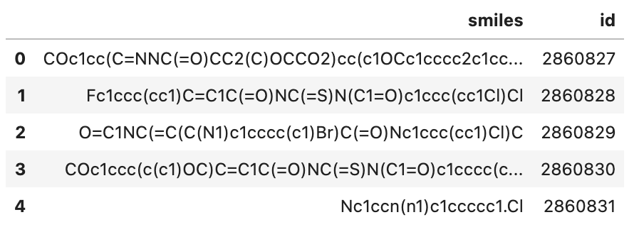
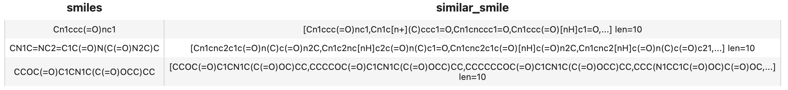

summary: Build a Molecular Search Engine in Minutes
id: build-a-molecular-search-engine-in-minutes
categories: Medical
tags: molecular-search
status: Published
authors: Shiyu
Feedback Link: https://github.com/towhee-io/towhee

---

# Molecular Search by Structure or Substructure

## Introduction

duration: 1

Drug discovery, as the source of medical innovation, is an important part of new medicine research and development. Drug discovery is implemented by target selection and confirmation. In order to discover available compounds in the fragment space from billion-scale compound libraries, chemical fingerprint is usually retrieved for substructure search and similarity search.

This example will show you how to find the similar, sub or super molecular formula. Moreover, we managed to make the core functionality as simple as 10 lines of code with Towhee, so that you can start hacking your own molecular search engine.

## Preparations

duration: 2

### Install Dependencies

First we need to install dependencies such as pymilvus, towhee, rdkit and gradio.

```bash
$ python -m pip install -q pymilvus towhee rdkit-pypi gradio
```

### Prepare the Data

There is a subset of the [Pubchem dataset](https://ftp.ncbi.nlm.nih.gov/pubchem/Compound/CURRENT-Full/SDF/) (10000 SMILES) used in this demo, everyone can download on [Github](https://github.com/towhee-io/examples/releases/download/data/pubchem_10000.smi).

```bash
$ curl -L https://github.com/towhee-io/examples/releases/download/data/pubchem_10000.smi -O
```

**pubchem_10000.smi**: a file containing SMILES and corresponding ids.

Let's take a quick look:

```python
import pandas as pd

df = pd.read_csv('pubchem_10000.smi')
df.head()
```





To use the dataset for molecular search, let's first define the dictionary and helper function:

- `id_smiles`: a dictionary of id and corresponding smiles;
- `to_images(input)`: convert the input smiles or results to towhee.Image for display.

```python
from rdkit.Chem import Draw
from rdkit import Chem
from towhee.types.image_utils import from_pil

id_smiles = df.set_index('id')['smiles'].to_dict()

def to_images(inputs):
    if isinstance(inputs, str):
        smiles = inputs
        mol = Chem.MolFromSmiles(smiles)
        return from_pil(Draw.MolToImage(mol))
    imgs = []
    results = inputs
    for re in results:
        smiles = id_smiles[re.id]
        mol = Chem.MolFromSmiles(smiles)
        imgs.append(from_pil(Draw.MolToImage(mol)))
    return imgs
```

### Create Milvus Collection

Before getting started, please make sure you have [installed milvus](https://milvus.io/docs/v2.0.x/install_standalone-docker.md). Let's first create a `molecular_search` collection that uses the [L2 distance metric](https://milvus.io/docs/v2.0.x/metric.md#Euclidean-distance-L2) and an [IVF_FLAT index](https://milvus.io/docs/v2.0.x/index.md#IVF_FLAT).

```python
from pymilvus import connections, FieldSchema, CollectionSchema, DataType, Collection, utility

connections.connect(host='127.0.0.1', port='19530')

def create_milvus_collection(collection_name, dim):
    if utility.has_collection(collection_name):
        utility.drop_collection(collection_name)
    
    fields = [
    FieldSchema(name='id', dtype=DataType.INT64, descrition='ids', is_primary=True, auto_id=False),
    FieldSchema(name='embedding', dtype=DataType.BINARY_VECTOR, descrition='embedding vectors', dim=dim)
    ]
    schema = CollectionSchema(fields=fields, description='molecular similarity search')
    collection = Collection(name=collection_name, schema=schema)
    
    return collection

collection = create_milvus_collection('molecular_search', 2048)
```

## Load Molecular Fingerprint into Milvus

duration: 2

We first generate fingerprint from SMILES with daylight algorithm and insert the fingerprints into Milvus. Towhee provides a [method-chaining style API](https://towhee.readthedocs.io/en/main/index.html) so that users can assemble a data processing pipeline with operators.

```python
import towhee

dc = (
    towhee.read_csv('pubchem_10000.smi')
      .runas_op['id', 'id'](func=lambda x: int(x))
      .molecular_fingerprinting['smiles', 'fp'](algorithm='daylight')
      .to_milvus['id', 'fp'](collection=collection, batch=100)
)

print('Total number of inserted data is {}.'.format(collection.num_entities))
```

Total number of inserted data is 10000.

#### Explanation of Data Processing Pipeline

Here is detailed explanation for each line of the code:

`towhee.read_csv('pubchem_10000.smi')`: read tabular data from the file (smiles and id columns);

`.runas_op['id', 'id'](func=lambda x: int(x))`: for each row from the data, convert the data type of the column id from `str` to `int`;

`.molecular_fingerprinting['smiles', 'fp'](algorithm='daylight')`: use the daylight algorithm to generate fingerprint with the [rdkit operator](https://towhee.io/molecular-fingerprinting/rdkit) in towhee hub.

`.to_milvus['id', 'fp'](collection=collection, batch=100)`: insert molcular fingerprints in to Milvus;

## Query Molecular from Milvus with Towhee

duration: 3

Now that fingerprint for candidate SMILES have been inserted into Milvus, we can query across it. Again, we use Towhee to load the input SMILES, compute a fingerprint, and use it as a query in Milvus. Because Milvus only outputs IDs and distance values, we provide the `id_smiles` dictionary to get the original smiles based on IDs and display.

#### similarity search

```python
( towhee.dc['smiles'](['Cn1ccc(=O)nc1', 'CN1C=NC2=C1C(=O)N(C(=O)N2C)C', 'CCOC(=O)C1CN1C(C(=O)OCC)CC'])
      .molecular_fingerprinting['smiles', 'fp'](algorithm='daylight')
      .milvus_search['fp', 'result'](collection=collection, metric_type='JACCARD')
      .runas_op['result', 'similar_smile'](func=lambda res: [id_smiles[x.id] for x in res])
      .select['smiles', 'similar_smile']()
      .show()
)
```





If you want to show the molecular structure with images, you can use the `to_images` function.

```python
( towhee.dc['smiles'](['Cn1ccc(=O)nc1', 'CN1C=NC2=C1C(=O)N(C(=O)N2C)C', 'CCOC(=O)C1CN1C(C(=O)OCC)CC'])
      .molecular_fingerprinting['smiles', 'fp'](algorithm='daylight')
      .milvus_search['fp', 'result'](collection=collection, metric_type='JACCARD', limit=6)
      .runas_op['result', 'similar_smile'](func=to_images)
      .runas_op['smiles', 'smiles'](func=to_images)
      .select['smiles', 'similar_smile']()
      .show()
)
```


#### Superstructure and Substructure search

Milvus not only supports searching similar structures of molecular formulas, but also superstructure and substructure searches, you only need to specify the metric types:

- Similarly search: "JACCARD"
- Superstructure search: "SUPERSTRUCTURE"
- Substructure search: "SUBSTRUCTURE"

In the following example, the limit is set to 3, but there are less than 3 substructures or superstructures of the query formula in the Milvus dataset.

```python
( towhee.dc['smiles'](['Cn1ccc(=O)nc1', 'CN1C=NC2=C1C(=O)N(C(=O)N2C)C', 'CCOC(=O)C1CN1C(C(=O)OCC)CC'])
      .molecular_fingerprinting['smiles', 'fp'](algorithm='daylight')
      .milvus_search['fp', 'result_super'](collection=collection, metric_type='SUPERSTRUCTURE', limit=3)
      .milvus_search['fp', 'result_sub'](collection=collection, metric_type='SUBSTRUCTURE', limit=3)
      .runas_op['result_super', 'is_superstructure'](func=to_images)
      .runas_op['result_sub', 'is_substructure'](func=to_images)
      .runas_op['smiles', 'smiles'](func=to_images)
      .select['smiles', 'is_superstructure', 'is_substructure']()
      .show()
)
```


## Release a Showcase

duration: 2

We've done an excellent job on the core functionality of our molecular search engine. Now it's time to build a showcase with interface. [Gradio](https://gradio.app/) is a great tool for building demos. With Gradio, we simply need to wrap the data processing pipeline via a `search_smiles_with_metric` function:

```python
def search_smiles_with_metric(smiles, metric_type):
    def smiles_to_pil(smiles):
        mol = Chem.MolFromSmiles(smiles)
        return Draw.MolToImage(mol)
    
    with towhee.api() as api:
        milvus_search_function = (
            api.molecular_fingerprinting(algorithm='daylight')
                .milvus_search(collection='molecular_search', metric_type=metric_type, limit=5)
                .runas_op(func=lambda res: [smiles_to_pil(id_smiles[x.id]) for x in res])
                .as_function()
        )
    return milvus_search_function(smiles)
    
import gradio

interface = gradio.Interface(search_smiles_with_metric, 
                             [gradio.inputs.Textbox(lines=1, default='CN1C=NC2=C1C(=O)N(C(=O)N2C)C'), 
                              gradio.inputs.Radio(['JACCARD', 'substructure', 'superstructure'])],
                             [gradio.outputs.Image(type="pil", label=None) for _ in range(5)]
                            )

interface.launch(inline=True, share=True)
```
