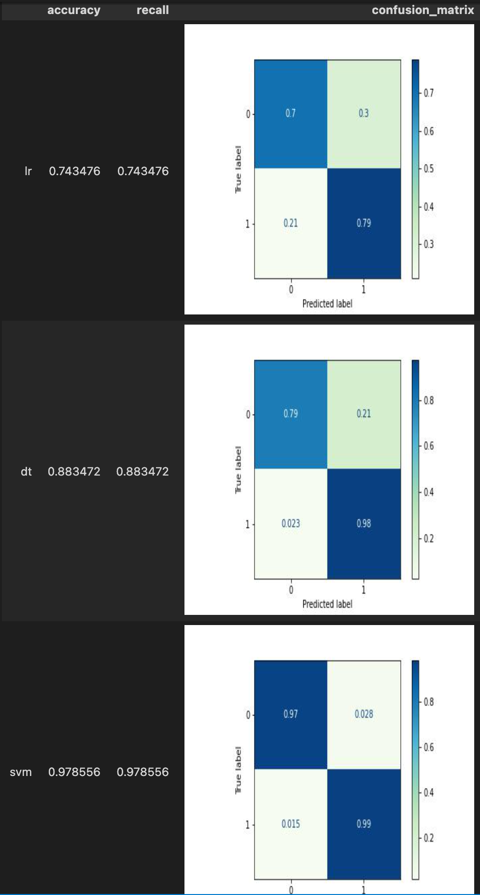
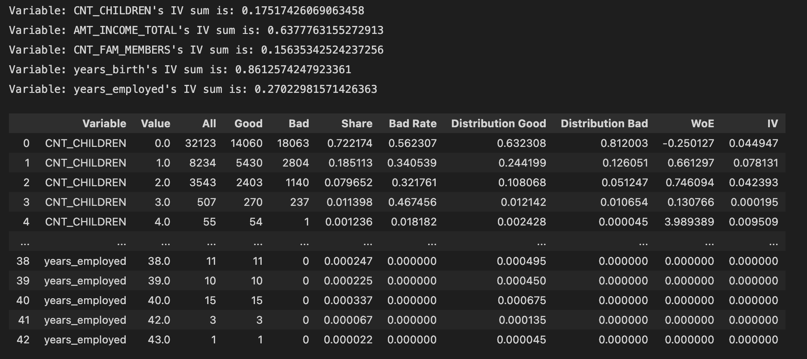

summary: Build a Credit Card Approval Predict Model in Minutes
id: build-a-credit-card-approval-predict-model-in-minutes
categories: Data-Science
tags: test-data-science
status: Published
authors: Kaiyuan
Feedback Link: https://github.com/towhee-io/towhee

---

# Credit Card Approval Prediction


## Introduction

duration: 1

Credit score cards are a common risk control method in the financial industry. It uses personal information and data submitted by credit card applicants to predict the probability of future defaults and credit card borrowings. The bank is able to decide whether to issue a credit card to the applicant. Credit scores can objectively quantify the magnitude of risk.

This colab shows you how to use Towhee to predict whether the bank issues a credit card to the applicant, and it has a good following on [Kaggle](https://www.kaggle.com/code/chizzzy/credit-card-approval-prediction/notebook?scriptVersionId=92959791) as well.

## Data Processing With Pandas

duration: 5

First load the data as Dataframe for further processing.

```python
import pandas as pd

record = pd.read_csv("../input/credit-card-approval-prediction/credit_record.csv", encoding = 'utf-8')
data = pd.read_csv("../input/credit-card-approval-prediction/application_record.csv", encoding = 'utf-8')
```

Find the first month that users' data were recorded and rename the column with a more understandable name.

```python
begin_month=pd.DataFrame(record.groupby(["ID"])["MONTHS_BALANCE"].agg(min))
begin_month=begin_month.rename(columns={'MONTHS_BALANCE':'begin_month'})
```

Process the `STATUS` column to find out if candidates have the record of overdue. Here is a table describe what each label stands for:
- X: No loan for the month;
- C: paid off that month;
- 0: 1-29 days past due;
- 1: 30-59 days past due;
- 2: 60-89 days overdue;
- 3: 90-119 days overdue;
- 4: 120-149 days overdue;
- 5: Overdue or bad debts, write-offs for more than 150 days

```python
record.loc[record['STATUS']=='X', 'STATUS']=-1 
record.loc[record['STATUS']=='C', 'STATUS']=-1 
record.loc[record['STATUS']=='0', 'STATUS']=0 
record.loc[record['STATUS']=='1', 'STATUS']=1
record.loc[record['STATUS']=='2', 'STATUS']=2
record.loc[record['STATUS']=='3', 'STATUS']=3 
record.loc[record['STATUS']=='4', 'STATUS']=4 
record.loc[record['STATUS']=='5', 'STATUS']=5
record.groupby('ID')['STATUS'].max().value_counts(normalize=True)
```

The result:
```shell
 0    0.754202
-1    0.129455
 1    0.101838
 2    0.007307
 5    0.004241
 3    0.001914
 4    0.001044
```

Generally, users in risk should be less than 3%, thus those who overdue for more than 60 days should be marked as risk users.

```python
record.loc[record['STATUS']>=2, 'dep_value']=1
record.loc[record['STATUS']<2, 'dep_value']=0 
temp = record[['ID', 'dep_value']].groupby('ID').sum()
temp.loc[temp['dep_value']!=0, 'dep_value']='Yes'
temp.loc[temp['dep_value']==0, 'dep_value']= 'No'
temp.value_counts(normalize=True)
```

The result:
```shell
dep_value
No           0.985495
Yes          0.014505
```

Merge the information into one dataframe, and mark those risk users with target `1` while other users `0`. We will regard the `target` column as result. Meanwhile, we should drop those rows with missing values to avoid disturb.

```python
new_data=pd.merge(data,begin_month,how="left",on="ID")
new_data=pd.merge(new_data, temp,how='inner',on='ID')
new_data['target']=new_data['dep_value']
new_data.loc[new_data['target']=='Yes','target']=1
new_data.loc[new_data['target']=='No','target']=0
```

```python
pd.set_option('display.max_columns', None)
pd.set_option('display.max_rows', 100)
new_data.head()
```

Before we get started, we should take a rough look at our samples, in case inbalanced data leading to a weird result.

```python
new_data = new_data.dropna()
new_data['target'].value_counts()
```

The result:
```shell
0    24712
1      422
```

Obviously the data are extremely in balance, so we'll need to resample the data.

```python
from imblearn.over_sampling import SMOTEN
X = new_data[['ID', 'CODE_GENDER', 'FLAG_OWN_CAR', 'FLAG_OWN_REALTY', 'CNT_CHILDREN', 'AMT_INCOME_TOTAL', 'NAME_INCOME_TYPE', 
       'NAME_EDUCATION_TYPE', 'NAME_FAMILY_STATUS', 'NAME_HOUSING_TYPE', 'DAYS_BIRTH', 'DAYS_EMPLOYED', 'FLAG_MOBIL',
       'FLAG_WORK_PHONE', 'FLAG_PHONE', 'FLAG_EMAIL', 'OCCUPATION_TYPE', 'CNT_FAM_MEMBERS', 'begin_month','dep_value']]
y = new_data['target'].astype('int')
X_balance,y_balance = SMOTEN().fit_resample(X, y)
X_balance = pd.DataFrame(X_balance, columns = X.columns)
X_balance.insert(0, 'target', y_balance)
new_data = X_balance
```


## Building Models with Towhee

duration: 8

In the following part, we will use Towhee's DataCollection API to deal with the processed data. DataCollection provides a series API to support training, prediction, and evaluating with machine learning models.

Also, Towhee has encapsulated several models as built-in operators, which we will introduce in the following training part.

### Prepare Training And Testing Data

Users can use `from_df` to load data from a dataframe then split the data into training set and test set with `split_train_test`, the ratio is 9:1 by default.

```python
import towhee
out = towhee.from_df(new_data).unstream()
out = (
    out.runas_op['DAYS_BIRTH', 'years_birth'](func=lambda x: -int(x)//365)
        .runas_op['DAYS_EMPLOYED', 'years_employed'](func=lambda x: -int(x)//365)
)
train, test = out.split_train_test()
```

Another important API is `runas_op`, which enables users running self-defined functions as operators effortless.

In the example above, we defined a lambda function to calculate age and work experience (years) from given info (days), and feed it to `runas_op`. In this way, DataCollection will wrap and register it as an operator and execute.

Note that the content inside the `[]` are the input and output columns, i.e. input column is `DAYS_BIRTH` and the output will be stored in `age`. This is a tricky part in DataCollection design. In many cases we might need to process some columns inside DataCollection, so we introduced `[]` to tell the DC which columns we are dealing with. 

Usage:
- Single input Single output: `['input', 'output']`
- Single input Multi outputs: `['input', ('output_1, output_2')]`
- Multi inputs Single output: `[('input_1', 'input_2'), 'output']`
- Multi inputs Multi outputs: `[('input_1', 'input_2'), ('output_1, output_2')]`

### Feature Extract

Then we need to process some data, include:
- Discretize the numerical data, both continuous data and binary data;
- Encode categorical data with non-digital value;
- Stack chosen features into a feature tensor;

```python
def feature_extract(dc):
    return (
        dc.num_discretizer['CNT_CHILDREN', 'childnum'](n_bins=3)
        .num_discretizer['AMT_INCOME_TOTAL', 'inc'](n_bins=5)
        .num_discretizer['years_birth', 'age'](n_bins=5)
        .num_discretizer['years_employed', 'worktm'](n_bins=5)
        .num_discretizer['CNT_FAM_MEMBERS', 'fmsize'](n_bins=5)
        .cate_one_hot_encoder['NAME_INCOME_TYPE', 'inctp']()
        .cate_one_hot_encoder['OCCUPATION_TYPE', 'occyp']()
        .cate_one_hot_encoder['NAME_HOUSING_TYPE', 'houtp']()
        .cate_one_hot_encoder['NAME_EDUCATION_TYPE', 'edutp']()
        .cate_one_hot_encoder['NAME_FAMILY_STATUS', 'famtp']()
        .cate_one_hot_encoder['CODE_GENDER', 'gender']()
        .cate_one_hot_encoder['FLAG_OWN_CAR', 'car']()
        .cate_one_hot_encoder['FLAG_OWN_REALTY', 'realty']()
        .tensor_hstack[('childnum', 'inc', 'age', 'worktm', 'fmsize',
                        'inctp', 'occyp', 'houtp', 'edutp', 'famtp',
                        'gender', 'car', 'realty'), 'fea']()
    )
```

### Model

Towhee encapsulates several machine learning models as built-in operators so that users can easily access to. In this tutorial, we will user logistic regression, decision tree, and support vector machine.

#### Train

Before trainging the model, make sure the DataCollection is set to training mode with `dc.set_training()`.

To train a model, Let's take logistic regression as an example:

```logistic_regression[('feature', 'actual_result'), 'predict_result'](name = 'model_name', kwargs)```

- logistic_regression is the operator name of the built-in algorithm;
- The `[]` specifies the input and output columns;
- Each model requires a unique name, so as to load its state and predict with it in the coming step;
- kwargs are the arguements of the model, they are exactly same as sklearn models.

```python
train = feature_extract(train.set_training())
```

```python
train.logistic_regression[('fea', 'target'), 'lr_predict'](name = 'logistic', max_iter=10) \
    .decision_tree[('fea', 'target'), 'dt_predict'](name = 'decision_tree', splitter = 'random', max_depth = 10) \
    .svc[('fea', 'target'), 'svm_predict'](name = 'svm_classifier', C = 0.8, kernel='rbf', probability=True)
```

#### Evaluate

```python
test = feature_extract(test.set_evaluating(train.get_state()))
```

The trained models are ready and the states are properly stored, we can predict with them and see how they works.

First, make sure the DC is set to evaluating mode. Then we can run prediction with exact same API as training. There are serval points to pay attention to:
- When `set_evaluating()`, we need to pass the `_state` of the DataCollection `train` we trained in previous step where all the model states are stored in;
- Make sure your model name is same as the one you trained. As we said, a model's name is the unique identifier. A user might train several logistic regression models with different names, and evaluate with different lr model by specifying different names;
- `with_metrics` function allow users to clarify the metrics they are interested in;

```python
metrics = test.set_evaluating(train._state) \
    .logistic_regression[('fea', 'target'), 'lr_predict'](name='logistic') \
    .decision_tree[('fea', 'target'), 'dt_predict'](name='decision_tree') \
    .svc[('fea', 'target'), 'svm_predict'](name='svm_classifier') \
    .with_metrics(['accuracy', 'recall', 'confusion_matrix']) \
    .evaluate['target', 'lr_predict']('lr') \
    .evaluate['target', 'dt_predict']('dt') \
    .evaluate['target', 'svm_predict']('svm') \
    .report()
```



## Futher Experiment

duration: 5

### Ensemble

Towhee also support self-defined algorithm operators, here is a example of xgboost classifier we present to ensemble the results from logistic regression, decision tree and support vector machine.
- Use `register` decorator to register your operator for future calling;
- All the model operators should be a subclass of `StatefulOperator` with a name;
- a `fit` function and `predict` function is required;

```python
from towhee import register
from towhee.operator import StatefulOperator
from xgboost import XGBClassifier
from scipy import sparse
import numpy as np

@register
class XGBClassifierOperator(StatefulOperator):
    def __init__(self, name):
        super().__init__(name=name)
    
    def fit(self):
        X = sparse.vstack(self._data[0])
        y = np.array(self._data[1]).reshape([-1, 1])
        self._state.model = XGBClassifier(n_estimators=100)
        self._state.model.fit(X, y)
        
    def predict(self, *arg):
        return self._state.model.predict(arg[0])[0]
```

Stack the prediction results from lr, dt and svm into a new feature as the input of our ensemble model.

```python
for i in ['lr_predict', 'dt_predict','svm_predict']:
	train.runas_op[i,i](func=lambda x: x[0])
	test.runas_op[i,i](func=lambda x: x[0])

train = train.tensor_hstack[('lr_predict', 'dt_predict','svm_predict'), 'ensemble_predict']()
test = test.tensor_hstack[('lr_predict', 'dt_predict', 'svm_predict'), 'ensemble_predict']()
```

```python
train.set_training().XGBClassifierOperator[('ensemble_predict', 'target'), 'xgb_predict'](name='XGBClassifierOperator')

metrics = test.set_evaluating(train._state) \
    .XGBClassifierOperator[('ensemble_predict', 'target'), 'xgb_predict'](name='XGBClassifierOperator') \
    .with_metrics(['accuracy', 'recall', 'confusion_matrix']) \
    .evaluate['target', 'xgb_predict']('xgb') \
    .report()
```


### Improve

The result from previous process is not extremely satsifying, so we can futher improve the performance by analysing the features. DC provides a `feature_summarize` API to help understanding data. Then we should extract these feature according to their pattern to discretize properly.

```python
train.feature_summarize['CNT_CHILDREN', 'AMT_INCOME_TOTAL','CNT_FAM_MEMBERS', 'years_birth', 'years_employed'](target='target')
```


The table summarize the values of the columns listed in `[]`:
- `All`: number of this value appeared in this column;
- `Good`: number of this value in this column with `target` labelled '0';
- `Bad`: number of this value in this column with `target` labelled '1';
- `Share`: the ratio of this value in this column;
- `Bad Rate`: `Bad`/`All`;
- `Distribution Good`: `Good`/ number of `target` labelled '0';
- `Distribution Bad`: `Bad`/ number of `target` labelled '1';
- `WoE`:  Weight of Evidence. A measure of how much the evidence supports or undermines a hypothesis. WOE measures the relative risk of an attribute of binning level. The value depends on whether the value of the target variable is a nonevent or an event.

- `IV`: Information Value, measures the variable's ability to predict. The IV values of the various types are the difference between the conditional positive rate and the conditional negative rate multiplied by the WOE value of the variable. The total IV value of the variable can be understood as the weighted sum of the conditional positive rate and the conditional negative rate difference.