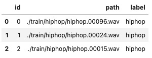
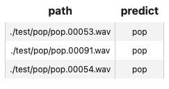
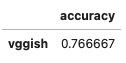

summary: Recognize Music Genre using Embeddings
id: music-genre-classification
categories: Audio
tags: audio-classification
status: Published
authors: Mengjia
Feedback Link: https://github.com/towhee-io/towhee

---

# Audio Classification: Recognize Genre using Embeddings

## Introduction

duration: 2

A **music genre classification system** automatically identifies a piece of music by matching a short snippet against a database of known music.
Compared to the traditional methods using frequency domain analysis, the use of embedding vectors generated by 1D convolutional neural networks improves recall and can, in some cases, improve query speed.

A music genre classification system generally transforms audio data to embeddings and compares similarity based on distances between embeddings.
Therefore, an encoder converting audio to embedding and a database for vector storage and retrieval are main components.

### Overview

Normally an audio embedding pipeline generates a set of embeddings given an audio path, which composes a unique fingerprint representing the input music. Each embedding corresponds to features extracted for a snippet of the input audio. By comparing embeddings of audio snippets, the system can determine the similarity between audios. The image below explains the music fingerprinting by audio embeddings.


A block diagram for a basic music genre classification system is shown in images below. The first image illustrates how the system transforms a music dataset to vectors with [Towhee](https://github.com/towhee-io/towhee) and then inserts all vectors into [Milvus](https://github.com/milvus-io/milvus). The second image shows the querying process of an unknown music snippet.


Building a music genre classification system typically involves the following steps:

1. Model and pipeline selection
2. Computing embeddings for the existing music dataset
3. Insert all generated vectors into a vector database
4. Identify an unknown music snippet by similarity search of vectors

In the upcoming sections, we will first walk you through some of the prep work for this tutorial. After that, we will elaborate on each of the four steps mentioned above.

## Preparation

duration: 2

First, we need to install Python packages, download example data, and prepare Milvus.

### Install packages

Make sure you have installed required python packages with proper versions:

```bash
! python -m pip install -q pymilvus towhee towhee.models gradio
```

### Download dataset

This tutorial uses a subset of [GTZAN](http://marsyas.info/downloads/datasets.html). You can download it via [Github](https://github.com/towhee-io/examples/releases/download/data/gtzan300.zip).

The data is organized as follows:

- train: candidate music, 10 classes, 30 audio files per class (300 in total)
- test: query music clips, same 10 classes as train data, 3 audio files per class (30 in total)
- gtzan300.csv: a csv file containing an id, path, and label for each video in train data

```bash
! curl -L https://github.com/towhee-io/examples/releases/download/data/gtzan300.zip -O
! unzip -q -o gtzan300.zip
```

Let's take a quick look and prepare a id-label dictionary for future use:

```python
import pandas as pd

df = pd.read_csv('./gtzan300.csv')
id_label = df.set_index('id')['label'].to_dict()

df.head(3)
```



### Start Milvus

Before getting started with the system, we also need to prepare Milvus in advance. Milvus is an open-source vector database built to power embedding similarity search and AI applications. More info about Milvus is available [here](https://github.com/milvus-io/milvus).

Please make sure that you have started a Milvus service ([Milvus Guide](https://milvus.io/docs/v2.0.x/install_standalone-docker.md)). Here we prepare a function to work with a Milvus collection with the following parameters:

- [L2 Distance](https://milvus.io/docs/v2.0.x/metric.md#Euclidean-distance-L2)
- [IVF-Flat Index](https://milvus.io/docs/v2.0.x/index.md#IVF_FLAT)

```python
from pymilvus import connections, FieldSchema, CollectionSchema, DataType, Collection, utility

connections.connect(host='localhost', port='19530')

def create_milvus_collection(collection_name, dim):    
    if utility.has_collection(collection_name):
        utility.drop_collection(collection_name)
    
    fields = [
    FieldSchema(name='id', dtype=DataType.INT64, descrition='ids', is_primary=True, auto_id=False),
    FieldSchema(name='embedding', dtype=DataType.FLOAT_VECTOR, descrition='embedding vectors', dim=dim)
    ]
    schema = CollectionSchema(fields=fields, description='audio classification')
    collection = Collection(name=collection_name, schema=schema)

    # create IVF_FLAT index for collection.
    index_params = {
        'metric_type':'L2',
        'index_type':"IVF_FLAT",
        'params':{"nlist": 400}
    }
    collection.create_index(field_name="embedding", index_params=index_params)
    return collection
```

## Build System

duration: 5

Now we are ready to build a music genre classification system. We will select models, generate & save embeddings, and then perform a query example.

### 1. Model and pipeline selection

The first step in building a music genre classification system is selecting an appropriate embedding model and one of its associated pipelines. Within Towhee, all pipelines can be found on the [Towhee hub](https://towhee.io/tasks/operator). Clicking on any of the categories will list available operators based on the specified task; selecting `audio-embedding` will reveal all audio embedding operators that Towhee offers. We also provide an option with summary of popular audio embedding pipelines [here](https://docs.towhee.io/pipelines/audio-embedding).

Resource requirements, accuracy, inference latency are key trade-offs when selecting a proper pipeline. Towhee provides a multitude of pipelines to meet various application demands. For demonstration purposes, we will use [vggish](https://towhee.io/audio-embedding/vggish) with [method-chaining stype API](https://towhee.readthedocs.io/en/main/index.html) in this tutorial.

- `towhee.read_csv()`: read tabular data from csv file 
- `.audio_decode.ffmpeg['path', 'frames']`: an embeded Towhee operator reading audio as frames ([learn more](https://towhee.io/audio-decode/ffmpeg))
- `.audio_embedding.vggish['frames', 'vecs']`: an embeded Towhee operator applying pretrained VGGish to audio frames, which can be used to generate video embedding ([learn more](https://towhee.io/audio-embedding/vggish))
- `.runas_op['vecs', 'vecs']`: process vectors using a function for purpose like normalization, format convention, etc.
- `.runas_op[('id', 'vecs'), 'ids']`: for each audio input, generate a set of ids corresponding to its embeddings using a function

### 2. Generating embeddings for the existing music dataset

With optimal operators selected, generating audio embeddings over our music dataset is the next step. Each audio path will go though the pipeline and then output a set of vectors.

```python
import towhee
import numpy as np


# Please note the first time run will take time to download model and other files.

data = (
    towhee.read_csv('gtzan300.csv')
          .audio_decode.ffmpeg['path', 'frames']()
          .runas_op['frames', 'frames'](func=lambda x: [y[0] for y in x])
          .audio_embedding.vggish['frames', 'vecs']()
          .runas_op['vecs', 'vecs'](func=lambda vecs: [vec / np.linalg.norm(vec) for vec in list(vecs)])
          .runas_op[('id', 'vecs'), 'ids'](func=lambda x, v: [int(x) for _ in range(len(v))])
          .to_list()
)

ids = []
vecs = []
for x in data:
    ids = ids + x.ids
    vecs = vecs + x.vecs
```

### 3. Insert all generated embedding vectors into a vector database
While brute-force computation of distances between queries and all audio vectors is perfectly fine for small datasets, scaling to billions of music dataset items requires a production-grade vector database that utilizes a search index to greatly speed up the query process. Here, we'll insert vectors computed in the previous section into a Milvus collection.

```python
collection = create_milvus_collection('vggish', 128)
mr = collection.insert([ids, vecs])

print(f'Total inserted data:{collection.num_entities}')
```
    Total inserted data:9300

###  Identify an unknown music snippet by similarity search of vectors
We can use the same pipeline to generate a set of vectors for a query audio. Then searching across the collection will find the closest embeddings for each vector in the set.

First, let us define a `search_in_milvus` function in advance. It will query each vec in the input list over specified collection, and return most frequent labels from topk search results.

```python
from statistics import mode

def search_in_milvus(vecs_list, collection, topk):
    collection.load()
    res_id = (
        towhee.dc['vecs'](vecs_list)
          .milvus_search['vecs', 'results'](collection=collection, limit=topk)
          .runas_op['results', 'results'](func=lambda res: mode([re.id for re in res]))
          .select['results']()
          .as_raw()
          .to_list()
    )
    labels = [id_label[i] for i in res_id]
    return mode(labels)
```

The following example recognizes music genres for each audio under `./test/pop/*`.

```python
collection = Collection('vggish')

query = (
    towhee.glob['path']('./test/pop/*')
          .audio_decode.ffmpeg['path', 'frames']()
          .runas_op['frames', 'frames'](func=lambda x: [y[0] for y in x])
          .audio_embedding.vggish['frames', 'vecs']()
          .runas_op['vecs', 'vecs'](func=lambda vecs: [vec / np.linalg.norm(vec) for vec in list(vecs)])
          .runas_op['vecs', 'predict'](func=lambda x: search_in_milvus(vecs_list=x, collection=collection, topk=10))
          .select['path', 'predict']()
          .show()
)
```



## Evaluation

duration: 1

We have just built a music genre classification system. But how's its performance? We can evaluate the search engine against the ground truths. Here we use the metric `accuracy` to measure performance with the example test data of 30 audio files.

```python
performance = (
    towhee.glob['path']('./test/*/*.wav')
          .audio_decode.ffmpeg['path', 'frames']()
          .runas_op['frames', 'frames'](func=lambda x: [y[0] for y in x])
          .audio_embedding.vggish['frames', 'vecs']()
          .runas_op['vecs', 'vecs'](func=lambda vecs: [vec / np.linalg.norm(vec) for vec in list(vecs)])
          .runas_op['vecs', 'predict'](func=lambda x: search_in_milvus(vecs_list=x, collection=collection, topk=10))
          .runas_op['path', 'ground_truth'](func=lambda x: x.split('/')[-2])
          .with_metrics(['accuracy'])
          .evaluate['ground_truth', 'predict']('vggish')
          .report()
)
```



From test above, we can tell the accuracy of this basic music genre classification system is 77%. To make your own solution in production, you can build some more complicated system to improve performance. For example, Towhee provides more options of models and APIs to optimize execution.

## Release a Showcase

duration: 1

We've just built a music genre classification system and tested its performance. Now it's time to add some interface and release a showcase. Towhee provides `towhee.api()` to wrap the data processing pipeline as a function with `.as_function()`. So we can build a quick demo with this demo_function with [Gradio](https://gradio.app/).

```python
import gradio

with towhee.api() as api:
    demo_function = (
         api.audio_decode.ffmpeg()
            .runas_op(func=lambda x: [y[0] for y in x])
            .audio_embedding.vggish()
            .runas_op(func=lambda vecs: [vec / np.linalg.norm(vec) for vec in list(vecs)])
            .runas_op(func=lambda x: search_in_milvus(vecs_list=x, collection=collection, topk=10))
            .as_function()
    )
    

interface = gradio.Interface(demo_function, 
                             inputs=gradio.Audio(source='upload', type='filepath'),
                             outputs=gradio.Textbox(label="Music Genre")
                            )

interface.launch(inline=True, share=True)
```